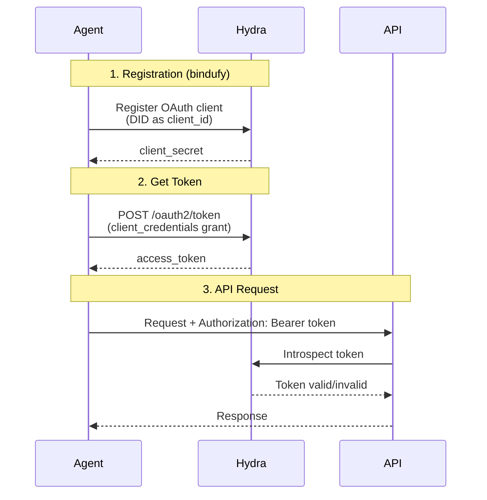

# Authentication

Bindu uses **Ory Hydra** as its authentication backend for production deployments. Authentication is optional - you can run agents without it for development and testing.

## How It Works



## Configuration

### Environment Variables

Configure Hydra connection via environment variables (see `.env.example`):

```bash
# Enable authentication
AUTH__ENABLED=true

# Set provider to Hydra (only supported provider)
AUTH__PROVIDER=hydra

# Hydra endpoints
HYDRA__ADMIN_URL=https://hydra-admin.getbindu.com
HYDRA__PUBLIC_URL=https://hydra.getbindu.com
```

**Configuration Options:**
- `AUTH__ENABLED`: Set to `true` to enable authentication
- `AUTH__PROVIDER`: Must be `hydra` (only supported provider)
- `HYDRA__ADMIN_URL`: Hydra Admin API endpoint for client management
- `HYDRA__PUBLIC_URL`: Hydra Public API endpoint for token operations

### Agent Configuration

No additional configuration needed in your agent code. Authentication is handled automatically when environment variables are set.

## Getting Access Tokens

### Method 1: API Request

When you deploy your agent, obtain an access token using the OAuth2 client credentials flow:

```bash
curl -X POST https://hydra.getbindu.com/oauth2/token \
  -H "Content-Type: application/x-www-form-urlencoded" \
  -d "grant_type=client_credentials" \
  -d "client_id=did:bindu:<YOUR_AGENT_DID>" \
  -d "client_secret=<YOUR_CLIENT_SECRET>" \
  -d "scope=openid offline agent:read agent:write"
```

**Response:**
```json
{
  "access_token": "eyJhbGciOiJSUzI1NiIsInR5cCI6IkpXVCJ9...",
  "expires_in": 3600,
  "scope": "openid offline agent:read agent:write",
  "token_type": "bearer"
}
```

**Finding Your Credentials:**
- **Agent DID**: Found in the agent card at `/.well-known/agent.json`
- **Client Secret**: Located in `.bindu/oauth_credentials.json` file

### Method 2: UI (Recommended for Testing)

Use the frontend UI to obtain tokens easily:

1. Start the frontend:
   ```bash
   cd frontend
   npm run dev
   ```

2. Navigate to: **Settings → Authentication**

3. Enter your `CLIENT_SECRET` (from `.bindu/oauth_credentials.json`)

4. Click **Get Access Token**

5. Copy the generated token

## Using Access Tokens

Include the access token in the `Authorization` header for all API requests:

```bash
curl --location 'http://localhost:3773/' \
--header 'Content-Type: application/json' \
--header 'Authorization: Bearer <your-access-token>' \
--data '{
    "jsonrpc": "2.0",
    "method": "message/send",
    "params": {
        "message": {
            "role": "user",
            "content": "Hello!"
        }
    },
    "id": 1
}'
```
