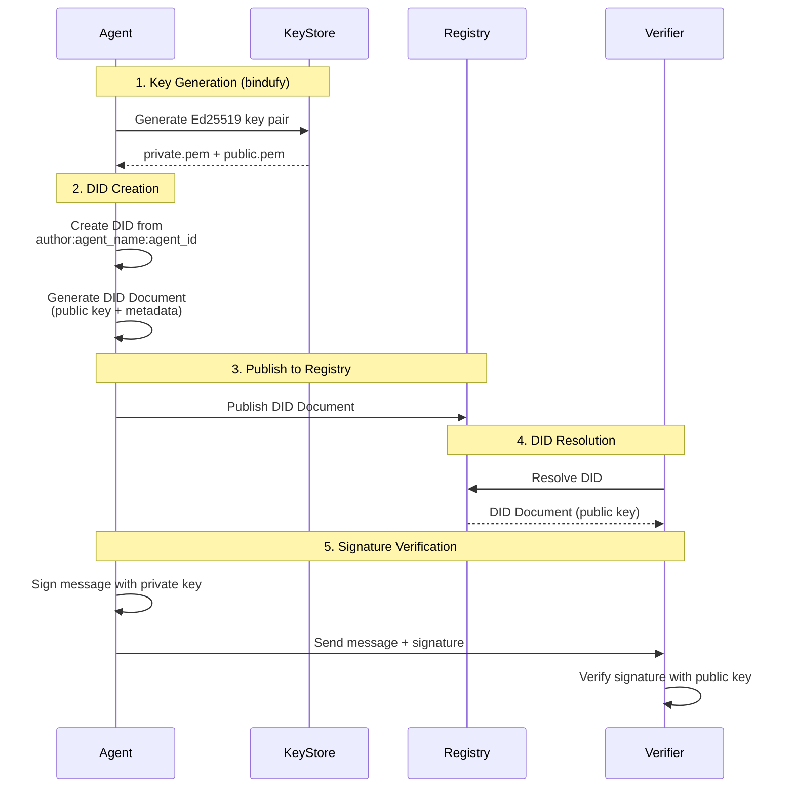

# Decentralized Identifiers (DIDs)

Bindu uses **Decentralized Identifiers (DIDs)** to provide secure, verifiable, and self-sovereign identity for AI agents. Each agent gets a unique DID that serves as its cryptographic identity across the network.

> **New to DIDs?** Think of a DID as a permanent, cryptographic "passport" for your AI agent that works everywhere, can't be taken away, and proves your agent's identity without needing permission from any company or authority.

## What is a DID?

A **DID (Decentralized Identifier)** is a globally unique identifier that:
- **Doesn't require a central authority** - No single entity controls it
- **Is cryptographically verifiable** - Backed by public/private key pairs
- **Is persistent** - Remains valid across platforms and time
- **Enables trust** - Verify agent authenticity without intermediaries

### The Problem DIDs Solve

Traditional identity systems have critical flaws:

**Centralized Control:**
- Your identity is controlled by companies (Google, Facebook, etc.)
- They can suspend or delete your account at any time
- You can't move your identity between platforms
- Single point of failure - if the company goes down, so does your identity

**Lack of Verification:**
- Hard to prove you're talking to the real agent
- Easy to impersonate or create fake accounts
- No cryptographic proof of identity
- Trust relies on the platform, not the agent itself

**DIDs Fix This:**
- **You own your identity** - No company can take it away
- **Cryptographically verifiable** - Prove authenticity with math, not trust
- **Portable** - Use the same identity across any platform
- **Permanent** - Your DID never expires or gets reassigned

### DID Format

Bindu DIDs follow the W3C standard structure with a custom method:

```
did:bindu:<email>:<agent_name>:<unique_hash>
```

**Example:**
```
did:bindu:gaurikasethi88_at_gmail_com:echo_agent:352c17d030fb4bf1ab33d04b102aef3d
```

**Breaking it down:**

| Component | Value | Purpose |
|-----------|-------|----------|
| `did:` | Fixed prefix | Identifies this as a DID (W3C standard) |
| `bindu` | Method name | Specifies this is a Bindu DID method |
| `gaurikasethi88_at_gmail_com` | Creator identifier | Links to agent creator (sanitized email) |
| `echo_agent` | Agent name | Human-readable agent identifier |
| `352c17d030fb4bf1ab33d04b102aef3d` | Unique hash | Cryptographic uniqueness guarantee |

### DID Syntax Rules

Based on W3C DID Core specification:

- **Character set:** ASCII letters (A-Z, a-z), digits (0-9), and symbols `._:%-`
- **Case sensitive:** `did:bindu:Agent` ≠ `did:bindu:agent`
- **Must start with:** `did:` (lowercase)
- **Method segment:** Lowercase letters followed by `:`
- **Maximum length:** 2048 characters (Bindu limit)
- **No query/fragment:** `?` and `#` are not allowed in Bindu DIDs

**Valid DIDs:**
```
did:bindu:user_at_example_com:my_agent:abc123
did:bindu:alice:research_bot:xyz789
```

**Invalid DIDs:**
```
DID:bindu:...           # Wrong: uppercase DID
did:Bindu:...           # Wrong: uppercase method
did:bindu:my agent:...  # Wrong: spaces not allowed
did:bindu:agent?v=1     # Wrong: query parameters not allowed
```

## How DIDs Work: A Complete Picture



### The DID Lifecycle

```
1. CREATION                    2. REGISTRATION              3. RESOLUTION
   ┌─────────────┐                ┌─────────────┐              ┌─────────────┐
   │ Generate    │                │ Publish DID │              │ Query DID   │
   │ Key Pair    │───────────────>│ Document    │─────────────>│ Document    │
   │             │                │             │              │             │
   └─────────────┘                └─────────────┘              └─────────────┘
         │                              │                            │
         v                              v                            v
   Private Key                    Public Registry              Verify Identity
   (Keep Secret!)                 (Bindu Network)              (Use Public Key)
```

**Step 1: Creation**
- Agent generates Ed25519 key pair (public + private keys)
- DID is constructed from creator email, agent name, and key hash
- Private key is stored securely (never shared!)

**Step 2: Registration**
- DID document is created with public key and metadata
- Document is published to Bindu Directory

**Step 3: Resolution**
- Anyone can query the DID to get the public document
- Public key is used to verify signatures from the agent

## DID Resolution

### What is DID Resolution?

DID resolution is the process of retrieving a **DID Document** - a JSON file containing public information about the agent, including:
- Public keys for signature verification
- Service endpoints (where to reach the agent)
- Creation timestamp
- Authentication methods

Think of it like looking up a phone number in a directory, but instead of getting a phone number, you get cryptographic proof of identity.

### Resolve a DID

Get the DID document for an agent:

```bash
curl -X POST http://localhost:3773/did/resolve \
  -H "Content-Type: application/json" \
  -d '{
    "did": "did:bindu:gaurikasethi88_at_gmail_com:echo_agent:352c17d030fb4bf1ab33d04b102aef3d"
  }'
```

### DID Document Structure

**Response:**
```json
{
    "@context": [
        "https://www.w3.org/ns/did/v1",
        "https://getbindu.com/ns/v1"
    ],
    "id": "did:bindu:gaurikasethi88_at_gmail_com:echo_agent:352c17d030fb4bf1ab33d04b102aef3d",
    "created": "2026-02-11T05:33:56.969079+00:00",
    "authentication": [
        {
            "id": "did:bindu:...#key-1",
            "type": "Ed25519VerificationKey2020",
            "controller": "did:bindu:...",
            "publicKeyBase58": "<base58-encoded-public-key>"
        }
    ]
}
```

**Understanding Each Field:**

#### `@context` - Document Format Specification
```json
"@context": [
    "https://www.w3.org/ns/did/v1",      // W3C DID standard
    "https://getbindu.com/ns/v1"         // Bindu-specific extensions
]
```
Defines the JSON-LD context - essentially the "language" the document is written in. This ensures everyone interprets the document the same way.

#### `id` - The DID Itself
```json
"id": "did:bindu:gaurikasethi88_at_gmail_com:echo_agent:352c17d030fb4bf1ab33d04b102aef3d"
```
The unique identifier for this agent. This is what you use to reference the agent across the network.

#### `created` - Creation Timestamp
```json
"created": "2026-02-11T05:33:56.969079+00:00"
```
When this DID was first created (ISO 8601 format with UTC timezone). Useful for:
- Audit trails
- Age verification
- Historical tracking

#### `authentication` - Public Keys
```json
"authentication": [{
    "id": "did:bindu:...#key-1",                    // Key identifier
    "type": "Ed25519VerificationKey2020",           // Crypto algorithm
    "controller": "did:bindu:...",                  // Who owns this key
    "publicKeyBase58": "<base58-encoded-public-key>"
}]
```
The public keys used to verify signatures from this agent. Multiple keys can be listed for key rotation.

### Understanding Authentication Keys

The `authentication` section is the heart of DID security. It contains public keys that prove identity.

#### Key Components Explained

**Key Type (`type`)**
```json
"type": "Ed25519VerificationKey2020"
```
- Specifies the cryptographic algorithm
- **Ed25519** is a modern, secure signature scheme
- Fast, small signatures (64 bytes)
- Resistant to timing attacks
- Used by Signal, Tor, and other security-critical systems

**Why Ed25519?**
- **Security:** 128-bit security level (equivalent to 3072-bit RSA)
- **Speed:** 10-20x faster than RSA
- **Size:** Public keys are only 32 bytes
- **Deterministic:** Same message always produces same signature

**Controller (`controller`)**
```json
"controller": "did:bindu:gaurikasethi88_at_gmail_com:echo_agent:352c17d030fb4bf1ab33d04b102aef3d"
```
- Who has authority over this key
- Must match the DID itself (self-controlled)
- In future versions, could delegate to other DIDs

**Public Key (`publicKeyBase58`)**
```json
"publicKeyBase58": "<base58-encoded-public-key>"
```
- The actual public key in Base58 encoding
- **Base58:** Like Base64 but without confusing characters (0, O, I, l)
- Used to verify signatures from the agent
- Safe to share publicly (that's why it's called "public" key!)

#### How Signature Verification Works

```
Agent Side (Private):              Verifier Side (Public):
┌─────────────────┐                ┌─────────────────┐
│ 1. Create       │                │ 4. Get DID      │
│    Message      │                │    Document     │
└────────┬────────┘                └────────┬────────┘
         │                                  │
         v                                  v
┌─────────────────┐                ┌─────────────────┐
│ 2. Sign with    │                │ 5. Extract      │
│    Private Key  │                │    Public Key   │
└────────┬────────┘                └────────┬────────┘
         │                                  │
         v                                  v
┌─────────────────┐                ┌─────────────────┐
│ 3. Send Message │───────────────>│ 6. Verify       │
│    + Signature  │                │    Signature    │
└─────────────────┘                └────────┬────────┘
                                            │
                                            v
                                   ✓ Valid / ✗ Invalid
```

## Real-World Use Cases

### 1. Message Signing - Proving Authenticity

**Scenario:** An agent sends a research report. How do you know it's really from that agent?

**Without DIDs:**
```python
# Anyone could claim to be the agent
message = {
    "from": "research_agent",  # Easy to fake!
    "content": "Here's your report..."
}
```

**With DIDs:**
```python
import nacl.signing
import base58

# Agent side: Sign the message
private_key = nacl.signing.SigningKey(agent_private_key_bytes)
message = {"content": "Here's your report..."}
message_bytes = json.dumps(message).encode()
signature = private_key.sign(message_bytes).signature

signed_message = {
    "did": "did:bindu:alice_at_example_com:research_agent:abc123",
    "message": message,
    "signature": base58.b58encode(signature).decode()
}

# Recipient side: Verify the signature
did_doc = resolve_did(signed_message["did"])
public_key_b58 = did_doc["authentication"][0]["publicKeyBase58"]
public_key = nacl.signing.VerifyKey(base58.b58decode(public_key_b58))

try:
    public_key.verify(message_bytes, base58.b58decode(signed_message["signature"]))
    print("✓ Signature valid! Message is authentic.")
except nacl.exceptions.BadSignatureError:
    print("✗ Invalid signature! Message may be forged.")
```

**Real-World Impact:**
- Financial agents can sign transaction approvals
- Medical agents can sign diagnoses with legal validity
- Research agents can sign findings with attribution

### DID Signatures in Task Responses

When an agent completes a task, the response includes a cryptographic signature in the artifact metadata. This proves the message authenticity without requiring you to manually verify it.

**Example Task Response with DID Signature:**

```json
{
    "jsonrpc": "2.0",
    "id": "550e8400-e29b-41d4-a716-446655440025",
    "result": {
        "id": "550e8400-e29b-41d4-a716-446655440302",
        "context_id": "550e8400-e29b-41d4-a716-446655440038",
        "kind": "task",
        "status": {
            "state": "completed",
            "timestamp": "2026-02-11T13:33:28.151107+00:00"
        },
        "history": [
            {
                "kind": "message",
                "role": "user",
                "parts": [{"kind": "text", "text": "capital of india"}]
            },
            {
                "kind": "message",
                "role": "assistant",
                "parts": [
                    {
                        "kind": "text",
                        "text": "The capital of India is **New Delhi**."
                    }
                ]
            }
        ],
        "artifacts": [
            {
                "name": "result",
                "parts": [
                    {
                        "kind": "text",
                        "text": "The capital of India is **New Delhi**.",
                        "metadata": {
                            "did.message.signature": "<base58-signature>"
                        }
                    }
                ],
                "artifact_id": "807e4218-155f-4ffb-b880-08f60f3b2c4b"
            }
        ]
    }
}
```

**Key Field: `did.message.signature`**

Located in `result.artifacts[].parts[].metadata`, this field contains:
- **Base58-encoded signature** of the message content
- **Signed by the agent's private key** (which only the agent possesses)
- **Verifiable using the agent's public key** from their DID document

**What This Signature Proves:**

1. **Authenticity** - The message definitely came from the agent with this DID
2. **Integrity** - The message hasn't been tampered with since signing
3. **Non-repudiation** - The agent cannot deny sending this message
4. **Timestamp validity** - The message was created at the stated time

**Verifying the Signature:**

```python
import nacl.signing
import base58
import json

async def verify_task_response(task_response):
    """Verify a task response signature"""
    # Extract the signature
    artifact = task_response["result"]["artifacts"][0]
    part = artifact["parts"][0]
    message_text = part["text"]
    signature_b58 = part["metadata"]["did.message.signature"]

    # Get the agent's DID from the task (you'd get this from the agent card)
    agent_did = "did:bindu:gaurikasethi88_at_gmail_com:echo_agent:352c17d030fb4bf1ab33d04b102aef3d"

    # Resolve DID to get public key
    did_doc = await resolve_did(agent_did)
    public_key_b58 = did_doc["authentication"][0]["publicKeyBase58"]
    public_key = nacl.signing.VerifyKey(base58.b58decode(public_key_b58))

    # Verify the signature
    try:
        message_bytes = message_text.encode('utf-8')
        signature_bytes = base58.b58decode(signature_b58)
        public_key.verify(message_bytes, signature_bytes)
        print("✓ Signature valid! Response is authentic.")
        return True
    except nacl.exceptions.BadSignatureError:
        print("✗ Invalid signature! Response may be forged.")
        return False

# Usage
is_valid = await verify_task_response(task_response)
```

**When Signatures Are Added:**

- **Automatically** - Bindu agents sign all responses by default when DID is configured
- **Transparent** - No extra code needed in your agent implementation
- **Optional verification** - Clients can verify signatures but don't have to
- **Audit trail** - Signatures provide cryptographic proof for compliance/legal needs

### 2. Agent Discovery - Finding the Right Agent

**Scenario:** You need a PDF processing agent. How do you find trustworthy ones?

```python
import httpx

async def find_pdf_agents():
    # Search Bindu Directory
    response = await httpx.get(
        "https://bindus.directory/api/agents",
        params={"skill": "pdf-processing", "verified": True}
    )

    agents = response.json()["agents"]

    for agent in agents:
        # Resolve DID to verify it's legitimate
        did_doc = await resolve_did(agent["did"])

        # Check creation date (prefer established agents)
        created = datetime.fromisoformat(did_doc["created"])
        age_days = (datetime.now(timezone.utc) - created).days

        # Get agent manifest
        manifest = await httpx.get(f"{agent['url']}/.well-known/agent.json")

        print(f"Agent: {agent['name']}")
        print(f"DID: {agent['did']}")
        print(f"Age: {age_days} days")
        print(f"Skills: {manifest.json()['skills']}")
        print(f"Verified: ✓")
        print()

# Usage
await find_pdf_agents()
```

**Output:**
```
Agent: PDF Pro
DID: did:bindu:pdfpro_at_example_com:pdf_agent:xyz789
Age: 245 days
Skills: ['text_extraction', 'table_extraction', 'ocr']
Verified: ✓

Agent: Document Master
DID: did:bindu:docmaster_at_example_com:doc_agent:def456
Age: 89 days
Skills: ['pdf_parsing', 'form_filling']
Verified: ✓
```

### 3. Payment Verification - Secure Transactions

**Scenario:** User pays agent for service. How do both parties prove the transaction?

```python
from decimal import Decimal
import time

class PaymentProof:
    def __init__(self, from_did, to_did, amount, currency="USDC"):
        self.from_did = from_did
        self.to_did = to_did
        self.amount = str(amount)
        self.currency = currency
        self.timestamp = int(time.time())
        self.nonce = os.urandom(16).hex()

    def to_dict(self):
        return {
            "from_did": self.from_did,
            "to_did": self.to_did,
            "amount": self.amount,
            "currency": self.currency,
            "timestamp": self.timestamp,
            "nonce": self.nonce
        }

    def sign(self, private_key):
        """User signs payment proof"""
        message = json.dumps(self.to_dict(), sort_keys=True).encode()
        signing_key = nacl.signing.SigningKey(private_key)
        signature = signing_key.sign(message).signature
        return base58.b58encode(signature).decode()

    def verify(self, signature):
        """Agent verifies payment came from claimed user"""
        # Resolve user's DID
        did_doc = resolve_did(self.from_did)
        public_key_b58 = did_doc["authentication"][0]["publicKeyBase58"]
        public_key = nacl.signing.VerifyKey(base58.b58decode(public_key_b58))

        # Verify signature
        message = json.dumps(self.to_dict(), sort_keys=True).encode()
        try:
            public_key.verify(message, base58.b58decode(signature))
            return True
        except:
            return False

# Usage
payment = PaymentProof(
    from_did="did:bindu:alice_at_example_com:user:123",
    to_did="did:bindu:bob_at_example_com:agent:456",
    amount=Decimal("0.0001")
)

signature = payment.sign(alice_private_key)

if payment.verify(signature):
    print("✓ Payment verified! Proceeding with service...")
else:
    print("✗ Invalid payment proof!")
```

### 4. Multi-Agent Orchestration - Task Routing

**Scenario:** Complex task needs multiple specialized agents working together.

```python
class AgentOrchestrator:
    def __init__(self):
        self.agents = {}

    async def register_agent(self, did):
        """Register agent and verify its identity"""
        # Resolve DID
        did_doc = await resolve_did(did)

        # Get agent capabilities
        manifest = await self.get_manifest(did_doc)

        self.agents[did] = {
            "did": did,
            "skills": manifest["skills"],
            "public_key": did_doc["authentication"][0]["publicKeyBase58"],
            "endpoint": manifest["deployment"]["url"]
        }

    async def route_task(self, task):
        """Route task to best agent based on skills"""
        # Find agents with required skills
        candidates = [
            agent for agent in self.agents.values()
            if task["required_skill"] in agent["skills"]
        ]

        if not candidates:
            raise ValueError(f"No agent found for skill: {task['required_skill']}")

        # Use negotiation to select best agent
        best_agent = await self.negotiate(candidates, task)

        # Send task with cryptographic proof
        result = await self.send_task(
            to_did=best_agent["did"],
            task=task,
            signature=self.sign_task(task)
        )

        # Verify result came from expected agent
        if not self.verify_result(result, best_agent["public_key"]):
            raise SecurityError("Result signature invalid!")

        return result

# Usage
orchestrator = AgentOrchestrator()

# Register agents
await orchestrator.register_agent("did:bindu:alice:pdf_agent:abc")
await orchestrator.register_agent("did:bindu:bob:translate_agent:def")
await orchestrator.register_agent("did:bindu:carol:summarize_agent:ghi")

# Complex workflow
task = {
    "type": "process_document",
    "steps": [
        {"skill": "pdf_extraction", "input": "document.pdf"},
        {"skill": "translation", "target_lang": "es"},
        {"skill": "summarization", "max_length": 500}
    ]
}

result = await orchestrator.route_task(task)
print(f"Task completed! Result: {result}")
```

### 5. Audit Trails - Compliance and Accountability

**Scenario:** Regulatory compliance requires proof of all agent actions.

```python
class AuditLog:
    def __init__(self):
        self.entries = []

    def log_action(self, agent_did, action, data, signature):
        """Log agent action with cryptographic proof"""
        entry = {
            "timestamp": datetime.utcnow().isoformat(),
            "agent_did": agent_did,
            "action": action,
            "data": data,
            "signature": signature
        }

        # Verify signature
        if not self.verify_entry(entry):
            raise SecurityError("Invalid signature in audit log!")

        self.entries.append(entry)

    def verify_entry(self, entry):
        """Verify audit entry signature"""
        did_doc = resolve_did(entry["agent_did"])
        public_key_b58 = did_doc["authentication"][0]["publicKeyBase58"]
        # ... verification logic ...
        return True

    def generate_report(self, start_date, end_date):
        """Generate compliance report"""
        filtered = [
            e for e in self.entries
            if start_date <= datetime.fromisoformat(e["timestamp"]) <= end_date
        ]

        report = {
            "period": {"start": start_date, "end": end_date},
            "total_actions": len(filtered),
            "agents": list(set(e["agent_did"] for e in filtered)),
            "entries": filtered,
            "all_verified": all(self.verify_entry(e) for e in filtered)
        }

        return report

# Usage
audit = AuditLog()

# Log actions
audit.log_action(
    agent_did="did:bindu:medical_agent:abc",
    action="diagnosis",
    data={"patient_id": "P123", "diagnosis": "..."},
    signature="..."
)

# Generate compliance report
report = audit.generate_report(
    start_date=datetime(2026, 1, 1),
    end_date=datetime(2026, 12, 31)
)

print(f"Total actions: {report['total_actions']}")
print(f"All signatures valid: {report['all_verified']}")
```

## DID Generation

When you create a Bindu agent, a DID is automatically generated. Let's walk through the entire process:

### Automatic Generation

```python
config = {
    "author": "your.email@example.com",
    "name": "my_agent",
    "description": "My AI agent"
}

bindufy(config, handler)
# DID generated: did:bindu:your_email_at_example_com:my_agent:<hash>
```

### Step-by-Step Generation Process

**Step 1: Sanitize Email**
```python
# Input
author = "alice@example.com"

# Sanitization
# Replace @ with _at_
# Replace . with _
sanitized = "alice_at_example_com"
```

**Step 2: Generate Cryptographic Keys**
```python
import nacl.signing

# Generate Ed25519 key pair
signing_key = nacl.signing.SigningKey.generate()
private_key = signing_key.encode()  # Keep this SECRET!
public_key = signing_key.verify_key.encode()  # Share this
```

**Step 3: Create Unique Hash**
```python
import hashlib

# Hash the public key to create unique identifier
key_hash = hashlib.sha256(public_key).hexdigest()[:32]
# Result: "<32-char-hex-hash>"
```

**Step 4: Construct DID**
```python
did = f"did:bindu:{sanitized}:{agent_name}:{key_hash}"
# Result: "did:bindu:alice_at_example_com:my_agent:352c17d030fb4bf1ab33d04b102aef3d"
```

**Step 5: Create DID Document**
```python
did_document = {
    "@context": [
        "https://www.w3.org/ns/did/v1",
        "https://getbindu.com/ns/v1"
    ],
    "id": did,
    "created": datetime.utcnow().isoformat() + "+00:00",
    "authentication": [{
        "id": f"{did}#key-1",
        "type": "Ed25519VerificationKey2020",
        "controller": did,
        "publicKeyBase58": base58.b58encode(public_key).decode()
    }]
}
```

### Why This Design?

**Email in DID:**
- Provides human-readable context
- Helps with agent discovery
- Links agent to creator (accountability)
- Not used for authentication (just metadata)

**Unique Hash:**
- Guarantees global uniqueness
- Prevents collisions (two agents with same name)
- Derived from public key (cryptographic binding)
- Makes DIDs unpredictable (security)

**Best Practices:**
- Use a dedicated email for agent creation
- Choose descriptive agent names
- Store private keys in secure vaults (not in code!)
- Back up private keys (losing them = losing identity)

## Security Considerations

### Private Key Protection

**Critical:** Your private key is your agent's identity. Losing it or exposing it is catastrophic.

#### Storage Best Practices

**❌ NEVER DO THIS:**
```python
# DON'T hardcode keys in code
PRIVATE_KEY = "key_data_here" #pragma: allowlist secret

# DON'T commit to git
# .env file in repository
AGENT_PRIVATE_KEY=<key-data> #pragma: allowlist secret

# DON'T store in plain text files
with open("private_key.txt", "w") as f:
    f.write(private_key)
```


#### What If Private Key Is Compromised?

**Immediate Actions:**
1. **Stop using the compromised key immediately**
2. **Generate new key pair**
3. **Update DID document with new public key**
4. **Notify all services using your agent**
5. **Revoke old key** (mark as compromised)
6. **Investigate how compromise occurred**


### Key Rotation

Regular key rotation is a security best practice, even without compromise.

#### When to Rotate Keys

- **Scheduled:** Every 90-180 days
- **After team changes:** Employee leaves with key access
- **Compliance requirements:** Industry regulations (PCI-DSS, HIPAA)
- **Precautionary:** Suspected but unconfirmed compromise

## DID Standards

Bindu DIDs follow W3C standards:
- [W3C DID Core Specification](https://www.w3.org/TR/did-core/)
- [DID Method Registry](https://www.w3.org/TR/did-spec-registries/)
- Ed25519 signature scheme (RFC 8032)

## API Reference

### Resolve DID

```bash
POST /did/resolve
Content-Type: application/json

{
    "did": "did:bindu:..."
}
```

**Response:** DID Document (JSON-LD)

### Get Agent DID

```bash
GET /.well-known/agent.json
```

**Response:** Agent manifest including DID

## Inspiration

[Atproto](https://atproto.com/specs/did)

## Related Documentation

- [Authentication Guide](./AUTHENTICATION.md) - OAuth2 and token-based auth
- [Payment Integration](./PAYMENT.md) - X402 payment protocol with DIDs
- [W3C DID Specification](https://www.w3.org/TR/did-core/)
- [Bindu Directory](https://bindus.directory)
