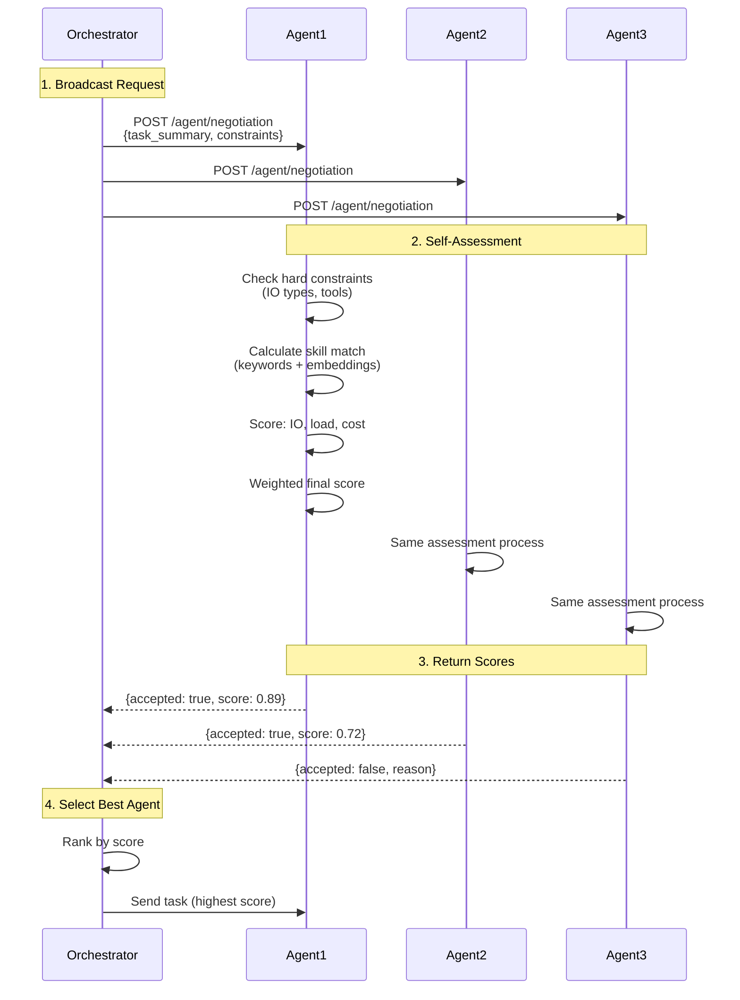

# Agent Negotiation

Capability-based agent selection for intelligent orchestration. Bindu's negotiation system enables orchestrators to query multiple agents and select the best one for a task based on skills, performance, load, and cost.

The orchestrator code is out of scope for this project. We have just implenented the client side of it.

## How It Works



### 1. Orchestrator Broadcasts

Orchestrator sends assessment request to multiple agents:

```bash
POST /agent/negotiation
```

### 2. Agents Self-Assess

Each agent evaluates:
- **Skill matching** - Do I have the required capabilities?
- **Performance** - Can I meet latency/quality requirements?
- **Load** - Am I available or overloaded?
- **Cost** - Does my pricing fit the budget?

### 3. Orchestrator Ranks

Responses are scored using weighted factors:

```python
score = (
    skill_match * 0.6 +        # Primary: capability matching
    io_compatibility * 0.2 +   # Input/output format support
    performance * 0.1 +        # Speed and reliability
    load * 0.05 +              # Current availability
    cost * 0.05                # Pricing
)
```

### 4. Best Agent Selected

Highest-scoring agent receives the task.

## Assessment API

### Request

```bash
POST /agent/negotiation
Content-Type: application/json

{
  "task_summary": "Extract tables from PDF invoices",
  "task_details": "Process invoice PDFs and extract structured data",
  "input_mime_types": ["application/pdf"],
  "output_mime_types": ["application/json"],
  "max_latency_ms": 5000,
  "max_cost_amount": "0.001",
  "min_score": 0.7,
  "weights": {
    "skill_match": 0.6,
    "io_compatibility": 0.2,
    "performance": 0.1,
    "load": 0.05,
    "cost": 0.05
  }
}
```

**Request Fields:**
- `task_summary` - Brief description of the task
- `task_details` - Detailed requirements (optional)
- `input_mime_types` - Expected input formats
- `output_mime_types` - Expected output formats
- `max_latency_ms` - Maximum acceptable latency
- `max_cost_amount` - Budget constraint
- `min_score` - Minimum confidence threshold
- `weights` - Custom scoring weights (optional)

### Response

```json
{
  "accepted": true,
  "score": 0.89,
  "confidence": 0.95,
  "skill_matches": [
    {
      "skill_id": "pdf-processing-v1",
      "skill_name": "PDF Processing",
      "score": 0.92,
      "reasons": [
        "semantic similarity: 0.95",
        "tags: pdf, tables, extraction",
        "capabilities: text_extraction, table_extraction"
      ]
    }
  ],
  "matched_tags": ["pdf", "tables", "extraction"],
  "matched_capabilities": ["text_extraction", "table_extraction"],
  "latency_estimate_ms": 2000,
  "queue_depth": 2,
  "subscores": {
    "skill_match": 0.92,
    "io_compatibility": 1.0,
    "performance": 0.85,
    "load": 0.90,
    "cost": 1.0
  }
}
```

**Response Fields:**
- `accepted` - Whether agent can handle the task
- `score` - Overall confidence score (0-1)
- `confidence` - Agent's self-assessed confidence
- `skill_matches` - Matched skills with reasoning
- `latency_estimate_ms` - Expected processing time
- `queue_depth` - Current task queue size
- `subscores` - Breakdown of scoring factors

## Scoring Algorithm

### Default Weights

```python
weights = {
    "skill_match": 0.6,        # 60% - Primary factor
    "io_compatibility": 0.2,   # 20% - Format support
    "performance": 0.1,        # 10% - Speed/reliability
    "load": 0.05,              # 5% - Availability
    "cost": 0.05               # 5% - Pricing
}
```

## Configuration

### Enable Negotiation

```python
config = {
    "name": "my_agent",
    "skills": ["skills/pdf-processing"],
    "negotiation": {
        "embedding_api_key": os.getenv("OPENROUTER_API_KEY"),
    }
}
```

### Environment Variables

```bash
# API key for semantic matching
OPENROUTER_API_KEY=sk-or-v1-your-key-here
```

## Use Cases

### Multi-Agent Translation

```bash
# Query 10 translation agents
for agent in translation-agents:
  curl http://$agent:3773/agent/negotiation \
    -d '{"task_summary": "Translate technical manual to Spanish"}'

# Responses ranked by orchestrator:
# Agent 1: score=0.98 (technical specialist, queue=2)
# Agent 2: score=0.82 (general translator, queue=0)
# Agent 3: score=0.65 (no technical specialization)
```

### Cost Optimization

```bash
# Find cheapest agent above quality threshold
agents = [a for a in query_all_agents(task) if a.score > 0.8]
cheapest = min(agents, key=lambda a: a.cost)
```

## Best Practices

### For Agent Developers

- **Accurate self-assessment** - Don't over-claim capabilities
- **Honest scoring** - Return realistic confidence scores
- **Update skills** - Keep skill metadata current
- **Monitor performance** - Track actual vs estimated latency

### For Orchestrators

- **Query multiple agents** - Get diverse options
- **Set minimum thresholds** - Filter low-quality matches
- **Custom weights** - Adjust for your priorities
- **Handle rejections** - Have fallback strategies

### Skill Metadata

```yaml
# Good: Specific and accurate
assessment:
  keywords:
    - invoice
    - pdf
    - table_extraction
  specializations:
    - domain: invoice_processing
      confidence_boost: 0.3

# Bad: Too generic
assessment:
  keywords:
    - document
    - processing
```

## Examples

### Simple Orchestrator

```python
import httpx

async def find_best_agent(task_summary, agent_urls):
    """Query agents and select the best one."""
    responses = []

    async with httpx.AsyncClient() as client:
        for url in agent_urls:
            try:
                resp = await client.post(
                    f"{url}/agent/negotiation",
                    json={"task_summary": task_summary}
                )
                if resp.status_code == 200:
                    responses.append({
                        "url": url,
                        "data": resp.json()
                    })
            except Exception as e:
                print(f"Agent {url} failed: {e}")

    # Select highest scoring agent
    if not responses:
        return None

    best = max(responses, key=lambda r: r["data"]["score"])
    return best["url"]

# Usage
best_agent = await find_best_agent(
    "Extract tables from PDF invoice",
    ["http://agent1:3773", "http://agent2:3773"]
)
```


## Related Documentation

- [Skills System](./SKILLS.md) - How to define agent capabilities
- [Examples](../examples/) - Complete orchestration examples
