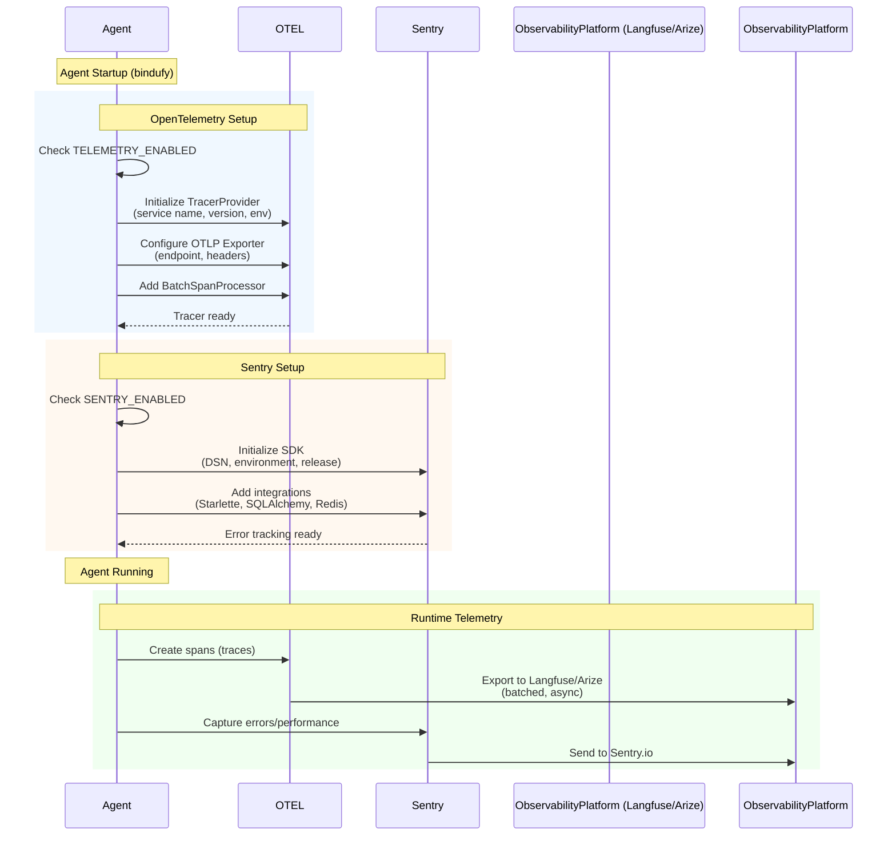

# Observability & Monitoring

Bindu integrates with **OpenTelemetry (OTEL)** and **Sentry** to provide comprehensive observability and error tracking for your agents. Monitor performance, trace execution flows, and debug issues using industry-standard platforms.

## Architecture




## OpenTelemetry Setup

### Supported Platforms

- **[Arize](https://arize.com/)** - AI observability platform for monitoring and debugging ML models
- **[Langfuse](https://langfuse.com/)** - Open-source LLM engineering platform with tracing and analytics
- **Any OTEL-compatible platform** - Supports standard OTLP protocol

### Configuration

Enable OpenTelemetry tracing via environment variables (see `.env.example`):

```bash
# Enable telemetry
TELEMETRY_ENABLED=true

# OTEL endpoint (platform-specific)
OLTP_ENDPOINT=https://cloud.langfuse.com/api/public/otel/v1/traces

# Service name for your agent
OLTP_SERVICE_NAME=research-agent

# Authentication headers (platform-specific)
OLTP_HEADERS={"Authorization":"Basic <base64-encoded-credentials>"}

# Optional: Enable verbose logging
OLTP_VERBOSE_LOGGING=true

# Optional: Additional configuration
OLTP_SERVICE_VERSION=1.0.0
OLTP_DEPLOYMENT_ENVIRONMENT=production
OLTP_BATCH_MAX_QUEUE_SIZE=2048
OLTP_BATCH_SCHEDULE_DELAY_MILLIS=5000
```

### Platform-Specific Setup

#### Langfuse

1. **Create Account**: Sign up at [cloud.langfuse.com](https://cloud.langfuse.com)

2. **Generate API Keys**:
   - Navigate to Settings → API Keys
   - Create new key pair (public and secret)

3. **Encode Credentials**:
   ```bash
   # Base64 encode "public-key:secret-key"
   echo -n "pk-xxx:sk-xxx" | base64
   ```

4. **Configure Environment**:
   ```bash
   TELEMETRY_ENABLED=true
   OLTP_ENDPOINT=https://cloud.langfuse.com/api/public/otel/v1/traces
   OLTP_SERVICE_NAME=your-agent-name
   OLTP_HEADERS={"Authorization":"Basic <base64-encoded-credentials>"}
   OLTP_VERBOSE_LOGGING=true
   ```

#### Arize

1. **Create Account**: Sign up at [arize.com](https://arize.com)

2. **Get Credentials**:
   - Navigate to Settings → API Keys
   - Copy Space ID and API Key

3. **Configure Environment**:
   ```bash
   TELEMETRY_ENABLED=true
   OLTP_ENDPOINT=https://otlp.arize.com/v1
   OLTP_SERVICE_NAME=your-agent-name
   OLTP_HEADERS={"space_id":"<your-space-id>","api_key":"<your-api-key>"}
   OLTP_VERBOSE_LOGGING=true
   ```

## Sentry Error Tracking

### Configuration

Enable Sentry via environment variables (see `.env.example`):

```bash
# Enable Sentry
SENTRY_ENABLED=true

# Sentry DSN (from your Sentry project)
SENTRY_DSN=https://<key>@<org-id>.ingest.sentry.io/<project-id>

# Optional: Environment name
SENTRY_ENVIRONMENT=production

# Optional: Release version
SENTRY_RELEASE=1.0.0

# Optional: Performance monitoring
SENTRY_TRACES_SAMPLE_RATE=1.0
SENTRY_PROFILES_SAMPLE_RATE=1.0
SENTRY_ENABLE_TRACING=true

# Optional: Privacy settings
SENTRY_SEND_DEFAULT_PII=false
SENTRY_DEBUG=false
```

### Setting Up Sentry

1. **Create Account**: Sign up at [sentry.io](https://sentry.io)

2. **Create Project**:
   - Select Python as platform
   - Copy the DSN from project settings

3. **Configure Environment**:
   ```bash
   SENTRY_ENABLED=true
   SENTRY_DSN=https://xxx@xxx.ingest.sentry.io/xxx
   SENTRY_ENVIRONMENT=production
   SENTRY_RELEASE=1.0.0
   ```

4. **Restart Agent**: Sentry initializes on startup


## Agent Configuration

No code changes needed - observability is configured via environment variables:

```python
config = {
    "author": "your.email@example.com",
    "name": "research_agent",
    "description": "A research assistant agent",
    "deployment": {"url": "http://localhost:3773", "expose": True},
    "skills": ["skills/question-answering"],
}

bindufy(config, handler)
```

## Best Practices

### Sampling

For high-traffic agents, use sampling to reduce costs:

```bash
# Sample 10% of traces
SENTRY_TRACES_SAMPLE_RATE=0.1

# Sample 10% of profiles
SENTRY_PROFILES_SAMPLE_RATE=0.1
```

### Environment Separation

Use different environments for development/production:

```bash
# Development
SENTRY_ENVIRONMENT=development
OLTP_SERVICE_NAME=agent-dev

# Production
SENTRY_ENVIRONMENT=production
OLTP_SERVICE_NAME=agent-prod
```


### Custom Sentry Context

```python
import sentry_sdk

sentry_sdk.set_context("business", {
    "plan": "premium",
    "credits": 100
})

sentry_sdk.set_tag("feature", "pdf-processing")
```

## Related Documentation

- [OpenTelemetry Python](https://opentelemetry.io/docs/instrumentation/python/)
- [Langfuse Documentation](https://langfuse.com/docs)
- [Arize Documentation](https://docs.arize.com/)
- [Sentry Python SDK](https://docs.sentry.io/platforms/python/)
