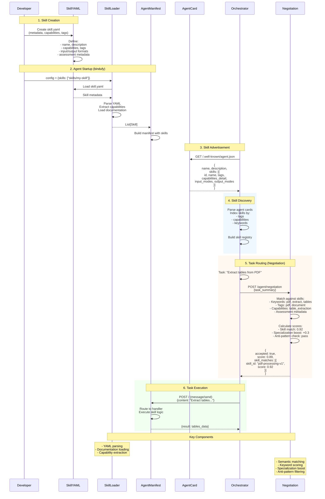

# Skills System

Skills are reusable capabilities that agents can advertise and execute. They enable intelligent task routing, capability discovery, and agent orchestration.

## How Skills Work



## Skill Structure

Skills are defined in YAML files with comprehensive metadata:

```yaml
skill_id: "pdf-processing-v1"
name: "PDF Processing"
version: "1.0.0"
description: "Extract text, tables, and forms from PDF documents"

capabilities:
  - text_extraction
  - table_extraction
  - form_filling
  - ocr_support

tags:
  - pdf
  - document
  - extraction

input_structure: |
  {
    "file": "base64_encoded_pdf_or_url",
    "operation": "extract_text|fill_form|extract_tables",
    "options": {
      "ocr": true,
      "language": "eng"
    }
  }

output_format: |
  {
    "success": true,
    "pages": [{"page_number": 1, "text": "...", "confidence": 0.98}],
    "metadata": {"total_pages": 10, "processing_time_ms": 1500}
  }

# Assessment metadata for negotiation
assessment:
  keywords:
    - pdf
    - extract
    - document

  specializations:
    - domain: invoice_processing
      confidence_boost: 0.3

  anti_patterns:
    - "pdf editing"
    - "pdf creation"
```

## Skill API Endpoints

### List All Skills

```bash
GET /agent/skills
```

**Response:**
```json
{
  "skills": [
    {
      "skill_id": "pdf-processing-v1",
      "name": "PDF Processing",
      "version": "1.0.0",
      "capabilities": ["text_extraction", "table_extraction"]
    }
  ]
}
```

### Get Skill Details

```bash
GET /agent/skills/{skill_id}
```

**Response:**
```json
{
  "skill_id": "pdf-processing-v1",
  "name": "PDF Processing",
  "description": "Extract text, tables, and forms from PDF documents",
  "input_structure": {...},
  "output_format": {...},
  "examples": [...]
}
```

### Get Skill Documentation

```bash
GET /agent/skills/{skill_id}/documentation
```

Returns human-readable documentation in Markdown format.

## Creating Skills

### 1. Create Skill File

Create a YAML file in `skills/` directory:

```yaml
# skills/my-skill/skill.yaml
skill_id: "my-skill-v1"
name: "My Skill"
version: "1.0.0"
description: "What this skill does"

capabilities:
  - capability1
  - capability2

tags:
  - tag1
  - tag2

documentation: |
  # My Skill

  Detailed documentation here...

input_structure: |
  {
    "field1": "value",
    "field2": 123
  }

output_format: |
  {
    "result": "output"
  }

examples:
  - title: "Example 1"
    input:
      field1: "test"
    output:
      result: "success"

assessment:
  keywords:
    - keyword1
    - keyword2
```

### 2. Register Skill in Agent Config

```python
config = {
    "name": "my_agent",
    "skills": ["skills/my-skill"],  # Path to skill directory
}
```

### 3. Implement Skill Logic

Skills are executed through your agent's handler function. The skill metadata is used for discovery and routing, while actual execution happens in your code.

## Skill Metadata Fields

### Required Fields

- `skill_id` - Unique identifier (e.g., "pdf-processing-v1")
- `name` - Human-readable name
- `version` - Semantic version (e.g., "1.0.0")
- `description` - Brief description of capability

### Optional Fields

- `capabilities` - List of specific capabilities
- `tags` - Keywords for discovery
- `documentation` - Detailed markdown documentation
- `input_structure` - JSON schema or example
- `output_format` - Expected output structure
- `examples` - Usage examples with input/output
- `error_handling` - How errors are handled
- `best_practices` - Guidelines for users
- `constraints` - Limitations and requirements
- `assessment` - Metadata for negotiation

## Assessment Metadata

Used by the negotiation system for intelligent agent selection:

```yaml
assessment:
  # Keywords for semantic matching
  keywords:
    - pdf
    - extract
    - document

  # Domain specializations with confidence boost
  specializations:
    - domain: invoice_processing
      confidence_boost: 0.3
    - domain: form_filling
      confidence_boost: 0.2

  # Patterns this skill should NOT match
  anti_patterns:
    - "pdf editing"
    - "pdf creation"

  # Complexity indicators for performance estimation
  complexity_indicators:
    simple:
      - "single page"
      - "extract text"
    medium:
      - "multiple pages"
      - "fill form"
    complex:
      - "scanned document"
      - "ocr"
```

## Best Practices

### Skill Design

- **Single responsibility** - One skill, one capability
- **Clear naming** - Descriptive skill_id and name
- **Versioning** - Use semantic versioning
- **Documentation** - Provide examples and error handling

### Input/Output

- **Structured formats** - Use JSON schemas
- **Validation** - Document required fields
- **Error handling** - Define error response format
- **Examples** - Include realistic use cases

### Assessment

- **Accurate keywords** - Match actual capabilities
- **Honest specializations** - Don't over-claim
- **Clear anti-patterns** - Prevent false matches
- **Complexity indicators** - Help with performance estimation

## Example Skills

See `examples/skills/` directory for complete examples:

- `skills/question-answering/` - Q&A capability
- `skills/pdf-processing/` - PDF document handling
- `skills/cbt-*/` - Therapy protocol skills
