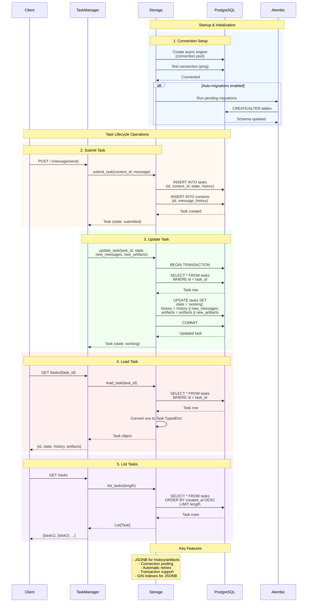

# PostgreSQL Storage

Bindu uses PostgreSQL as its persistent storage backend for production deployments. The storage layer is built with SQLAlchemy's async engine and uses imperative mapping with protocol TypedDicts.

**Storage is optional** - InMemoryStorage is used by default for development and testing.

## Architecture



## Storage Structure

The storage layer uses three main tables:

### 1. tasks_table
Stores all tasks with complete execution history and artifacts:
- `task_id` (UUID, primary key)
- `context_id` (UUID, foreign key to contexts_table)
- `status` (enum: pending, running, completed, failed, input_required)
- `history` (JSONB array of execution steps)
- `artifacts` (JSONB object for task outputs)
- `created_at`, `updated_at` (timestamps)

### 2. contexts_table
Maintains context metadata and message history:
- `context_id` (UUID, primary key)
- `messages` (JSONB array of conversation messages)
- `metadata` (JSONB object for custom data)
- `created_at`, `updated_at` (timestamps)

### 3. task_feedback_table
Optional feedback storage for tasks:
- `feedback_id` (UUID, primary key)
- `task_id` (UUID, foreign key to tasks_table)
- `feedback` (text)
- `rating` (integer, 1-5)
- `metadata` (JSONB object)
- `created_at` (timestamp)

## Configuration

### Environment Variables

Configure PostgreSQL connection via environment variables (see `.env.example`):

```bash
# Storage Configuration
# Type: "postgres" for PostgreSQL or "memory" for in-memory storage
STORAGE_TYPE=postgres

# PostgreSQL connection string
DATABASE_URL=postgresql+asyncpg://<user>:<password>@<host>:<port>/<database>?ssl=require
```

**Connection String Format:**
```
postgresql+asyncpg://<username>:<password>@<hostname>:<port>/<database>?ssl=require
```

**Example:**
```bash
DATABASE_URL=postgresql+asyncpg://bindu_user:<password>@localhost:5432/bindu_db?ssl=require
```

### Agent Configuration

No additional configuration needed in your agent code. Storage is configured via environment variables:

```python
config = {
    "author": "your.email@example.com",
    "name": "research_agent",
    "description": "A research assistant agent",
    "deployment": {"url": "http://localhost:3773", "expose": True},
    "skills": ["skills/question-answering", "skills/pdf-processing"],
}

bindufy(config, handler)
```

## Setting Up PostgreSQL

### Local Development

#### Using Docker (Recommended)

```bash
# Start PostgreSQL container
docker run -d \
  --name bindu-postgres \
  -e POSTGRES_USER=bindu_user \
  -e POSTGRES_PASSWORD=bindu_password \
  -e POSTGRES_DB=bindu_db \
  -p 5432:5432 \
  postgres:15-alpine

# Set environment variable
export DATABASE_URL="postgresql+asyncpg://bindu_user:<password>@localhost:5432/bindu_db"
```

#### Using Local PostgreSQL

1. Install PostgreSQL:
   ```bash
   # macOS
   brew install postgresql@15
   brew services start postgresql@15

   # Ubuntu/Debian
   sudo apt-get install postgresql-15
   sudo systemctl start postgresql
   ```

2. Create database and user:
   ```sql
   CREATE DATABASE bindu_db;
   CREATE USER bindu_user WITH ENCRYPTED PASSWORD '<your_password>';
   GRANT ALL PRIVILEGES ON DATABASE bindu_db TO bindu_user;
   ```

3. Set environment variable:
   ```bash
   export DATABASE_URL="postgresql+asyncpg://bindu_user:<password>@localhost:5432/bindu_db"
   ```

### Cloud Deployment

#### Neon (Serverless PostgreSQL)

1. Create account at [neon.tech](https://neon.tech)
2. Create a new project
3. Copy the connection string
4. Set environment variable:
   ```bash
   export DATABASE_URL="postgresql+asyncpg://<user>:<password>@ep-xxx.us-east-2.aws.neon.tech/bindu?sslmode=require"
   ```

## Database Migrations

Bindu uses Alembic for database migrations.

### Running Migrations

Migrations run automatically on startup by default. To disable:

```bash
# Disable automatic migrations
export STORAGE__RUN_MIGRATIONS_ON_STARTUP=false
```

### Manual Migration Commands

```bash
# Run all pending migrations
uv run alembic upgrade head

# Rollback one migration
uv run alembic downgrade -1

# View migration history
uv run alembic history

# Create new migration (for development)
uv run alembic revision --autogenerate -m "description"
```

### Migration Files

Located in `alembic/versions/`:
- `20251207_0001_initial_schema.py` - Initial database schema
- `20250614_0001_add_webhook_configs_table.py` - Webhook configurations
- Additional migrations as needed

### Manual Backup

```bash
# Backup database
pg_dump -h hostname -U username -d bindu_db > backup.sql

# Restore database
psql -h hostname -U username -d bindu_db < backup.sql
```
