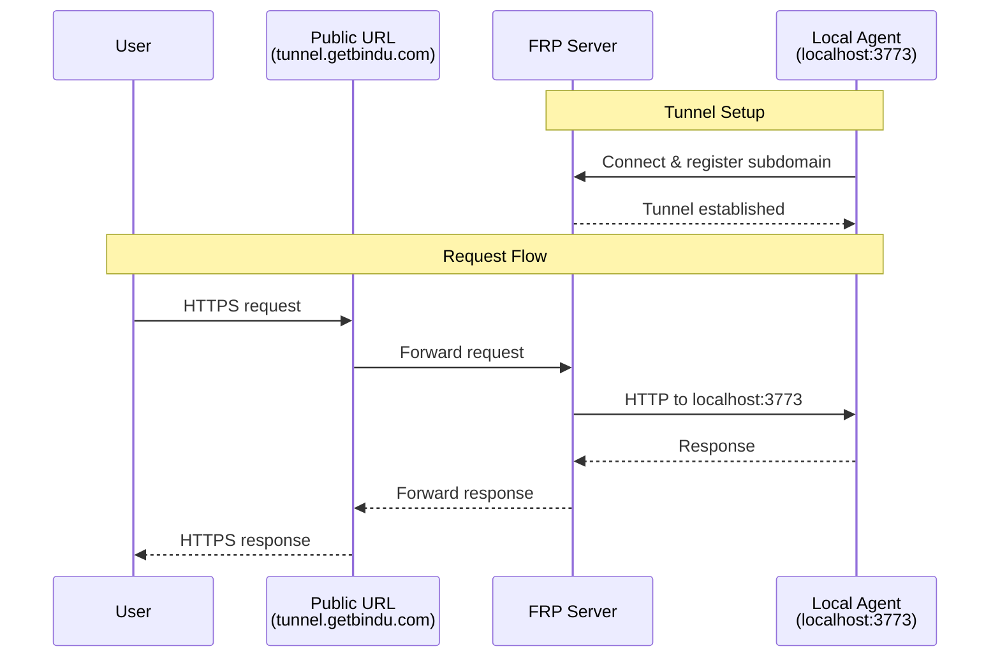

# Tunneling (Local Development Only)

Bindu provides built-in tunneling to expose your local agent to the internet during development and testing. This allows you to share your agent with others or test webhooks without deploying to a server.

> **⚠️ WARNING: For Local Development Only**
>
> Tunneling is designed for **local development and testing only**. Do NOT use tunneling in production environments. For production deployments, use proper hosting with SSL certificates and security configurations.

## Quick Start

Enable tunneling by setting `launch=True` in `bindufy()`:

```python
from bindu import bindufy

config = {
    "author": "your.email@example.com",
    "name": "my_agent",
    "description": "My development agent",
    "deployment": {"url": "http://localhost:3773", "expose": True},
    "skills": ["skills/question-answering"],
}

async def handler(message):
    return {"role": "assistant", "content": "Hello!"}

# Enable tunneling for local development
bindufy(config, handler, launch=True)
```

When you run your agent, you'll see:

```
✅ Tunnel established: https://abc123xyz.tunnel.getbindu.com
🌐 Agent accessible at: https://abc123xyz.tunnel.getbindu.com
```

## How It Works

Bindu uses FRP (Fast Reverse Proxy) tunneling to create a secure connection:

1. **Local Agent Starts** - Your agent runs on `localhost:3773`
2. **Tunnel Created** - FRP client connects to Bindu's tunnel server
3. **Public URL Generated** - Random subdomain assigned (e.g., `abc123xyz.tunnel.getbindu.com`)
4. **Traffic Forwarded** - Requests to public URL are forwarded to your local agent




## Use Cases

### 1. Local Development

Test your agent without deploying:

```bash
# Terminal 1: Start agent with tunnel
uv run python my_agent.py

# Terminal 2: Test from anywhere
curl https://abc123xyz.tunnel.getbindu.com/
```

## Limitations

- **Development Only** - Not suitable for production traffic
- **Temporary URLs** - Subdomain changes on each restart (unless custom)
- **No Persistence** - Tunnel closes when agent stops


### For Production

- ❌ **DO NOT** use tunneling in production

## Troubleshooting

### Connection Timeout

```bash
# Check internet connection
ping tunnel.getbindu.com

# Check firewall settings
# Ensure outbound connections to port 7000 are allowed
```
---

**Remember**: Tunneling is a development convenience, not a production solution. Always deploy to proper infrastructure for production workloads.
