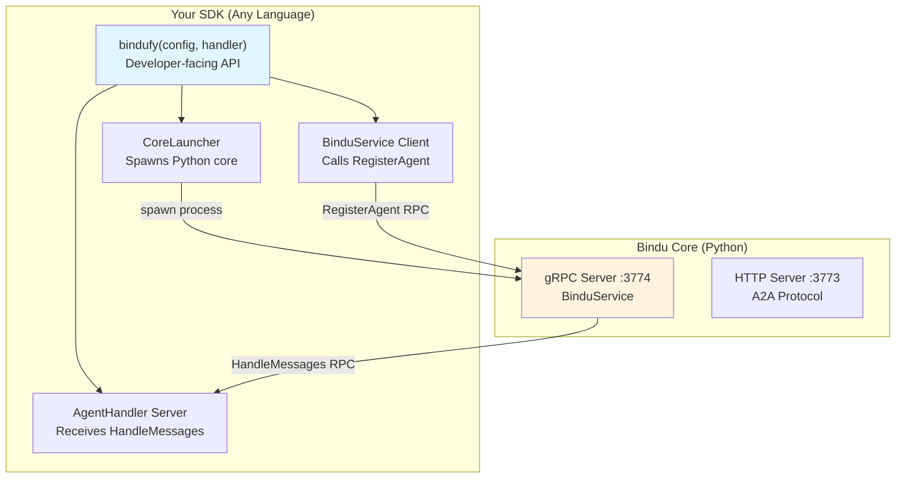

# Building Language SDKs

Guide for creating Bindu SDKs in new programming languages.

## Overview

A Bindu SDK is a thin wrapper (~200-400 lines) that:

1. **Generates gRPC stubs** from `proto/agent_handler.proto`
2. **Implements AgentHandler service** (receives HandleMessages calls)
3. **Implements BinduService client** (calls RegisterAgent on core)
4. **Spawns the Python core** as a child process
5. **Exposes `bindufy(config, handler)`** to developers

## Architecture



## Step-by-Step Guide

### 1. Generate gRPC Stubs

Use your language's protoc plugin to generate code from `proto/agent_handler.proto`.

**TypeScript:**
```bash
protoc --plugin=protoc-gen-ts=./node_modules/.bin/protoc-gen-ts \
  --ts_out=src/generated \
  --js_out=import_style=commonjs,binary:src/generated \
  proto/agent_handler.proto
```

**Kotlin:**
```kotlin
// build.gradle.kts
plugins {
    id("com.google.protobuf") version "0.9.4"
}

protobuf {
    protoc {
        artifact = "com.google.protobuf:protoc:3.25.0"
    }
    plugins {
        create("grpc") {
            artifact = "io.grpc:protoc-gen-grpc-java:1.60.0"
        }
    }
    generateProtoTasks {
        all().forEach {
            it.plugins {
                create("grpc")
            }
        }
    }
}
```

**Go:**
```bash
protoc --go_out=. --go_opt=paths=source_relative \
  --go-grpc_out=. --go-grpc_opt=paths=source_relative \
  proto/agent_handler.proto
```

**Rust:**
```bash
cargo install protobuf-codegen
protoc --rust_out=src/generated proto/agent_handler.proto
```

### 2. Implement AgentHandler Service

This service receives execution requests from the core.

**TypeScript Example:**

```typescript
import * as grpc from "@grpc/grpc-js";
import { AgentHandlerService } from "./generated/agent_handler_grpc_pb";
import { HandleRequest, HandleResponse } from "./generated/agent_handler_pb";

class AgentHandlerImpl implements AgentHandlerService {
  constructor(private handler: (messages: ChatMessage[]) => Promise<string>) {}

  async handleMessages(
    call: grpc.ServerUnaryCall<HandleRequest, HandleResponse>,
    callback: grpc.sendUnaryData<HandleResponse>
  ) {
    try {
      // 1. Convert proto messages to language-native format
      const messages = call.request.getMessagesList().map(m => ({
        role: m.getRole(),
        content: m.getContent()
      }));

      // 2. Call developer's handler
      const result = await this.handler(messages);

      // 3. Convert result to proto response
      const response = new HandleResponse();
      if (typeof result === "string") {
        response.setContent(result);
      } else {
        response.setContent(result.content);
        response.setState(result.state || "");
        response.setPrompt(result.prompt || "");
      }

      callback(null, response);
    } catch (error) {
      callback({
        code: grpc.status.INTERNAL,
        message: error.message
      });
    }
  }

  async getCapabilities(
    call: grpc.ServerUnaryCall<GetCapabilitiesRequest, GetCapabilitiesResponse>,
    callback: grpc.sendUnaryData<GetCapabilitiesResponse>
  ) {
    const response = new GetCapabilitiesResponse();
    response.setName(this.config.name);
    response.setVersion(this.config.version || "0.1.0");
    response.setSupportsStreaming(false); // Not implemented yet
    callback(null, response);
  }

  async healthCheck(
    call: grpc.ServerUnaryCall<HealthCheckRequest, HealthCheckResponse>,
    callback: grpc.sendUnaryData<HealthCheckResponse>
  ) {
    const response = new HealthCheckResponse();
    response.setHealthy(true);
    callback(null, response);
  }
}

// Start server
const server = new grpc.Server();
server.addService(AgentHandlerService, new AgentHandlerImpl(handler));
server.bindAsync(
  `0.0.0.0:${port}`,
  grpc.ServerCredentials.createInsecure(),
  (err, port) => {
    if (err) throw err;
    server.start();
    console.log(`AgentHandler server listening on :${port}`);
  }
);
```

**Key Points:**
- Implement all 4 methods: `HandleMessages`, `HandleMessagesStream`, `GetCapabilities`, `HealthCheck`
- Convert between proto messages and your language's native types
- Call the developer's handler function
- Handle errors gracefully

### 3. Implement BinduService Client

This client calls the core to register your agent.

**TypeScript Example:**

```typescript
import * as grpc from "@grpc/grpc-js";
import { BinduServiceClient } from "./generated/agent_handler_grpc_pb";
import { RegisterAgentRequest, RegisterAgentResponse } from "./generated/agent_handler_pb";

async function registerAgent(
  config: BinduConfig,
  skills: SkillDefinition[],
  callbackAddress: string
): Promise<RegisterAgentResponse> {
  const client = new BinduServiceClient(
    "localhost:3774",
    grpc.credentials.createInsecure()
  );

  const request = new RegisterAgentRequest();
  request.setConfigJson(JSON.stringify(config));
  request.setSkillsList(skills);
  request.setGrpcCallbackAddress(callbackAddress);

  return new Promise((resolve, reject) => {
    client.registerAgent(request, (err, response) => {
      if (err) reject(err);
      else resolve(response);
    });
  });
}
```

### 4. Implement CoreLauncher

Spawn the Python core as a child process.

**TypeScript Example:**

```typescript
import { spawn, ChildProcess } from "child_process";

export class CoreLauncher {
  private process: ChildProcess | null = null;

  async start(): Promise<void> {
    // Try different methods to find bindu CLI
    const commands = [
      ["bindu", ["serve", "--grpc"]],
      ["uv", ["run", "bindu", "serve", "--grpc"]],
      ["python", ["-m", "bindu.cli", "serve", "--grpc"]]
    ];

    for (const [cmd, args] of commands) {
      try {
        this.process = spawn(cmd, args, {
          stdio: ["ignore", "pipe", "pipe"]
        });

        // Wait for gRPC server to be ready
        await this.waitForReady("localhost:3774");
        return;
      } catch (error) {
        continue;
      }
    }

    throw new Error("Failed to start Bindu core");
  }

  private async waitForReady(address: string): Promise<void> {
    const maxAttempts = 30;
    for (let i = 0; i < maxAttempts; i++) {
      try {
        // Try to connect to gRPC server
        const client = new BinduServiceClient(
          address,
          grpc.credentials.createInsecure()
        );

        // Simple health check
        await new Promise((resolve, reject) => {
          client.waitForReady(Date.now() + 1000, (err) => {
            if (err) reject(err);
            else resolve(null);
          });
        });

        return; // Success!
      } catch {
        await new Promise(r => setTimeout(r, 100));
      }
    }

    throw new Error("Bindu core failed to start");
  }

  stop(): void {
    if (this.process) {
      this.process.kill();
      this.process = null;
    }
  }
}
```

**Key Points:**
- Try multiple methods to find the bindu CLI
- Wait for the gRPC server to be ready before proceeding
- Handle cleanup on shutdown

### 5. Implement bindufy() Function

Tie everything together in a developer-friendly API.

**TypeScript Example:**

```typescript
export async function bindufy(
  config: BinduConfig,
  handler: (messages: ChatMessage[]) => Promise<string | HandlerResponse>
): Promise<void> {
  // 1. Read skill files
  const skills = await readSkills(config.skills || []);

  // 2. Start AgentHandler gRPC server (random port)
  const handlerPort = await startAgentHandlerServer(handler);
  const callbackAddress = `localhost:${handlerPort}`;

  // 3. Spawn Python core
  const coreLauncher = new CoreLauncher();
  await coreLauncher.start();

  // 4. Register agent
  const response = await registerAgent(config, skills, callbackAddress);

  console.log(`✅ Agent registered!`);
  console.log(`   Agent ID: ${response.getAgentId()}`);
  console.log(`   DID: ${response.getDid()}`);
  console.log(`   URL: ${response.getAgentUrl()}`);

  // 5. Start heartbeat loop
  startHeartbeat(response.getAgentId());

  // 6. Handle shutdown
  process.on("SIGINT", async () => {
    await unregisterAgent(response.getAgentId());
    coreLauncher.stop();
    process.exit(0);
  });

  // Keep process alive
  await new Promise(() => {});
}
```

## Testing Your SDK

### 1. Unit Tests

Test each component in isolation:

```typescript
describe("AgentHandlerServer", () => {
  it("should handle messages", async () => {
    const handler = async (messages) => "Echo: " + messages[0].content;
    const server = new AgentHandlerServer(handler);

    const request = new HandleRequest();
    request.addMessages(new ChatMessage().setRole("user").setContent("Hi"));

    const response = await server.handleMessages(request);
    expect(response.getContent()).toBe("Echo: Hi");
  });
});
```

### 2. Integration Tests

Test the full flow:

```typescript
describe("bindufy", () => {
  it("should register and execute agent", async () => {
    const handler = async (messages) => "Test response";

    // Start agent
    bindufy({
      author: "test@example.com",
      name: "test-agent"
    }, handler);

    // Wait for registration
    await sleep(2000);

    // Send A2A request
    const response = await fetch("http://localhost:3773", {
      method: "POST",
      body: JSON.stringify({
        jsonrpc: "2.0",
        method: "message/send",
        params: { message: { parts: [{ text: "Hello" }] } }
      })
    });

    expect(response.ok).toBe(true);
  });
});
```

### 3. Manual Testing

```bash
# Start your SDK agent
node examples/simple-agent.js

# In another terminal, test with curl
curl http://localhost:3773/.well-known/agent.json | jq
```

## Best Practices

### Error Handling

```typescript
// Always wrap handler calls in try-catch
try {
  const result = await handler(messages);
  return result;
} catch (error) {
  console.error("Handler error:", error);
  throw new grpc.StatusError(
    grpc.status.INTERNAL,
    `Handler failed: ${error.message}`
  );
}
```

### Logging

```typescript
// Use structured logging
console.log(`[bindu] Registering agent: ${config.name}`);
console.log(`[bindu] AgentHandler listening on :${port}`);
console.log(`[bindu] Heartbeat sent for ${agentId}`);
```

### Type Safety

Provide full type definitions for your language:

```typescript
// TypeScript
export interface BinduConfig {
  author: string;
  name: string;
  description?: string;
  // ... all fields
}

export type HandlerResponse = string | {
  state?: string;
  content?: string;
  prompt?: string;
};
```

```kotlin
// Kotlin
data class BinduConfig(
    val author: String,
    val name: String,
    val description: String? = null
)

sealed class HandlerResponse {
    data class Text(val content: String) : HandlerResponse()
    data class Structured(
        val state: String?,
        val content: String?,
        val prompt: String?
    ) : HandlerResponse()
}
```

## Example SDKs

### TypeScript SDK Structure

```
sdks/typescript/
├── src/
│   ├── index.ts           # bindufy() function
│   ├── client.ts          # BinduService client
│   ├── server.ts          # AgentHandler server
│   ├── core-launcher.ts   # Spawns Python core
│   ├── types.ts           # TypeScript interfaces
│   └── generated/         # Proto-generated code
├── proto/
│   └── agent_handler.proto
├── package.json
└── tsconfig.json
```

### Kotlin SDK Structure

```
sdks/kotlin/
├── src/main/kotlin/com/getbindu/sdk/
│   ├── BinduAgent.kt      # bindufy() function
│   ├── Client.kt          # BinduService client
│   ├── Server.kt          # AgentHandler server
│   ├── CoreLauncher.kt    # Spawns Python core
│   └── Types.kt           # Kotlin data classes
├── build.gradle.kts
└── proto/
    └── agent_handler.proto
```

## Publishing Your SDK

### npm (TypeScript/JavaScript)

```json
{
  "name": "@bindu/sdk",
  "version": "0.1.0",
  "main": "dist/index.js",
  "types": "dist/index.d.ts",
  "files": ["dist/", "proto/"]
}
```

```bash
npm publish --access public
```

### Maven Central (Kotlin/Java)

```kotlin
publishing {
    publications {
        create<MavenPublication>("maven") {
            groupId = "com.getbindu"
            artifactId = "bindu-sdk"
            version = "0.1.0"
        }
    }
}
```

### crates.io (Rust)

```toml
[package]
name = "bindu-sdk"
version = "0.1.0"
```

```bash
cargo publish
```

## Resources

- **[Proto Definition](../../proto/agent_handler.proto)** - Single source of truth
- **[TypeScript SDK](../../sdks/typescript/)** - Reference implementation
- **[API Reference](./api-reference.md)** - Complete gRPC API docs
- **[Testing Guide](./testing.md)** - How to test your SDK

## Support

Questions? Open an issue on GitHub or reach out to the Bindu team.
