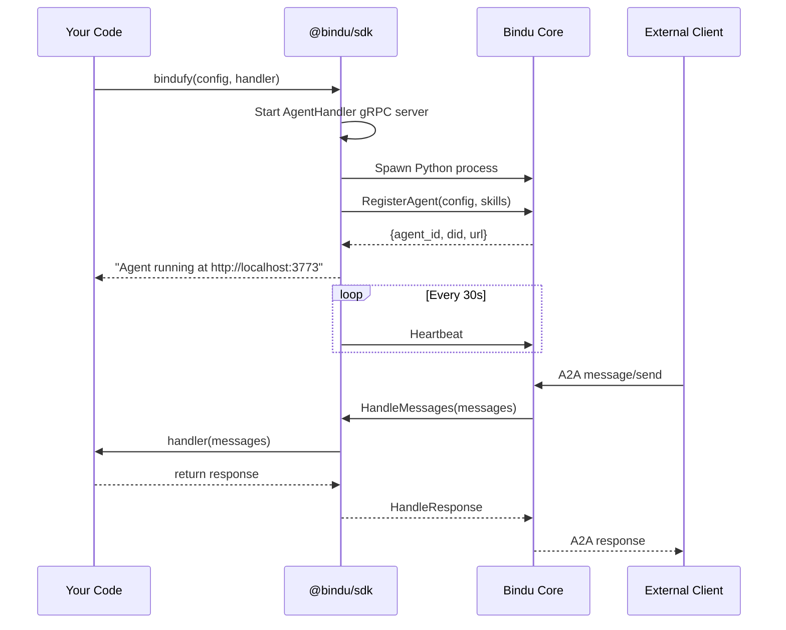

# TypeScript SDK Guide

Complete guide for building agents with the Bindu TypeScript SDK (`@bindu/sdk`).

## Installation

```bash
npm install @bindu/sdk
# or
yarn add @bindu/sdk
# or
pnpm add @bindu/sdk
```

## Quick Start

```typescript
import { bindufy } from "@bindu/sdk";

// Simple echo agent
bindufy({
  author: "dev@example.com",
  name: "my-agent",
  description: "A simple echo agent",
  deployment: {
    url: "http://localhost:3773",
    expose: true
  }
}, async (messages) => {
  const lastMessage = messages[messages.length - 1];
  return `Echo: ${lastMessage.content}`;
});
```

## How It Works

When you call `bindufy()`, the SDK:

1. **Reads skill files** from your project directory
2. **Starts a gRPC server** (AgentHandler) on a random port
3. **Spawns the Bindu core** as a child process (`bindu serve --grpc`)
4. **Registers your agent** via gRPC (RegisterAgent RPC)
5. **Starts heartbeat loop** (every 30 seconds)
6. **Waits for execution requests** (HandleMessages RPC)



## Configuration

### Full Config Example

```typescript
import { bindufy, BinduConfig } from "@bindu/sdk";

const config: BinduConfig = {
  // Required
  author: "dev@example.com",
  name: "my-agent",

  // Optional
  description: "My awesome agent",
  version: "1.0.0",

  // Deployment
  deployment: {
    url: "http://localhost:3773",
    expose: true,
    tunnel: {
      enabled: false,
      provider: "ngrok"
    }
  },

  // Skills
  skills: [
    "skills/question-answering",
    "skills/data-analysis"
  ],

  // Authentication
  auth: {
    enabled: false
  },

  // Payments (x402)
  x402: {
    enabled: false,
    provider: "coinbase",
    network: "base-sepolia"
  }
};

bindufy(config, async (messages) => {
  // Your handler logic
  return "Response";
});
```

### Config Fields

| Field | Type | Required | Description |
|-------|------|----------|-------------|
| `author` | `string` | ✅ | Your email or identifier |
| `name` | `string` | ✅ | Agent name (lowercase, hyphens) |
| `description` | `string` | ❌ | Agent description |
| `version` | `string` | ❌ | Agent version (default: "0.1.0") |
| `deployment.url` | `string` | ✅ | HTTP server URL |
| `deployment.expose` | `boolean` | ❌ | Expose to internet (default: false) |
| `skills` | `string[]` | ❌ | Paths to skill files |
| `auth.enabled` | `boolean` | ❌ | Enable authentication |
| `x402.enabled` | `boolean` | ❌ | Enable payments |

## Handler Function

The handler receives conversation history and returns a response.

### Basic Handler

```typescript
async function handler(messages: ChatMessage[]): Promise<string> {
  const lastMessage = messages[messages.length - 1];
  return `You said: ${lastMessage.content}`;
}

bindufy(config, handler);
```

### Handler with OpenAI

```typescript
import OpenAI from "openai";

const openai = new OpenAI({
  apiKey: process.env.OPENAI_API_KEY
});

bindufy(config, async (messages) => {
  const response = await openai.chat.completions.create({
    model: "gpt-4o",
    messages: messages.map(m => ({
      role: m.role as "user" | "assistant" | "system",
      content: m.content
    }))
  });

  return response.choices[0].message.content || "";
});
```

### Handler with LangChain

```typescript
import { ChatOpenAI } from "@langchain/openai";
import { HumanMessage, AIMessage, SystemMessage } from "@langchain/core/messages";

const llm = new ChatOpenAI({ modelName: "gpt-4o" });

bindufy(config, async (messages) => {
  const langchainMessages = messages.map(m => {
    if (m.role === "user") return new HumanMessage(m.content);
    if (m.role === "agent") return new AIMessage(m.content);
    return new SystemMessage(m.content);
  });

  const response = await llm.invoke(langchainMessages);
  return response.content as string;
});
```

## State Transitions

Return structured responses to control task state:

### Request User Input

```typescript
bindufy(config, async (messages) => {
  const lastMessage = messages[messages.length - 1];

  if (!lastMessage.content.includes("confirm")) {
    return {
      state: "input-required",
      prompt: "Please confirm by typing 'confirm'",
      content: "Waiting for confirmation..."
    };
  }

  return "Confirmed! Processing...";
});
```

### Request Authentication

```typescript
bindufy(config, async (messages) => {
  // Check if user is authenticated
  const isAuthenticated = checkAuth(messages);

  if (!isAuthenticated) {
    return {
      state: "auth-required",
      prompt: "Please authenticate to continue",
      content: "Authentication required"
    };
  }

  return "Processing authenticated request...";
});
```

### Response Format

| Return Type | Task State | Description |
|------------|------------|-------------|
| `string` | `completed` | Normal completion |
| `{state: "input-required", prompt: string}` | `input-required` | Task stays open, waits for user |
| `{state: "auth-required"}` | `auth-required` | Requires authentication |
| `{state: "payment-required"}` | `payment-required` | Requires payment |

## Skills

Skills are YAML or Markdown files that describe what your agent can do.

### Create a Skill

**`skills/question-answering.yaml`**
```yaml
name: question-answering
description: Answer questions about any topic
tags:
  - qa
  - general
examples:
  - "What is the capital of France?"
  - "Explain quantum computing"
```

### Reference in Config

```typescript
bindufy({
  // ... other config
  skills: [
    "skills/question-answering.yaml",
    "skills/data-analysis.yaml"
  ]
}, handler);
```

The SDK reads these files and sends them to the core during registration.

## Error Handling

```typescript
bindufy(config, async (messages) => {
  try {
    const result = await riskyOperation();
    return result;
  } catch (error) {
    console.error("Handler error:", error);
    return {
      state: "failed",
      content: `Error: ${error.message}`
    };
  }
});
```

## Environment Variables

The SDK respects these environment variables:

| Variable | Default | Description |
|----------|---------|-------------|
| `BINDU_CORE_HOST` | `localhost` | Bindu core gRPC host |
| `BINDU_CORE_PORT` | `3774` | Bindu core gRPC port |
| `BINDU_HANDLER_PORT` | Random | SDK's AgentHandler port |
| `BINDU_HEARTBEAT_INTERVAL` | `30000` | Heartbeat interval (ms) |

## Debugging

### Enable Debug Logs

```typescript
process.env.DEBUG = "bindu:*";

bindufy(config, handler);
```

### Check Agent Status

```bash
# Get agent card
curl http://localhost:3773/.well-known/agent.json | jq

# Check health
curl http://localhost:3773/health
```

## Current Limitations

### ❌ No Streaming Support

The TypeScript SDK currently **does not support streaming responses**. You must return complete responses.

```typescript
// ❌ This won't work
bindufy(config, async function* (messages) {
  yield "Chunk 1";
  yield "Chunk 2";
  yield "Chunk 3";
});

// ✅ This works
bindufy(config, async (messages) => {
  return "Complete response";
});
```

See [limitations](./limitations.md) for details.

## Examples

### Minimal Agent

```typescript
import { bindufy } from "@bindu/sdk";

bindufy({
  author: "dev@example.com",
  name: "echo-agent"
}, async (messages) => {
  return `Echo: ${messages[messages.length - 1].content}`;
});
```

### Agent with Context

```typescript
import { bindufy } from "@bindu/sdk";

const conversationHistory = new Map<string, any[]>();

bindufy({
  author: "dev@example.com",
  name: "context-agent"
}, async (messages) => {
  // Use full message history for context
  const context = messages.map(m =>
    `${m.role}: ${m.content}`
  ).join("\n");

  return `Based on our conversation:\n${context}\n\nMy response: ...`;
});
```

### Agent with External API

```typescript
import { bindufy } from "@bindu/sdk";
import axios from "axios";

bindufy({
  author: "dev@example.com",
  name: "weather-agent",
  skills: ["skills/weather.yaml"]
}, async (messages) => {
  const lastMessage = messages[messages.length - 1].content;

  // Extract location from message
  const location = extractLocation(lastMessage);

  // Call weather API
  const weather = await axios.get(
    `https://api.weather.com/v1/current?location=${location}`
  );

  return `The weather in ${location} is ${weather.data.condition}`;
});
```

## TypeScript Types

The SDK provides full TypeScript types:

```typescript
import {
  BinduConfig,
  ChatMessage,
  HandlerResponse,
  SkillDefinition
} from "@bindu/sdk";

// Config is fully typed
const config: BinduConfig = {
  author: "dev@example.com",
  name: "typed-agent"
};

// Handler has typed parameters and return
async function handler(
  messages: ChatMessage[]
): Promise<string | HandlerResponse> {
  // messages[0].role is typed as "user" | "agent" | "system"
  // messages[0].content is string

  return {
    state: "completed", // Autocomplete works!
    content: "Done"
  };
}
```

## Building and Publishing

### Build the SDK

```bash
cd sdks/typescript
npm run build
```

This compiles TypeScript to JavaScript in `dist/`.

### Publish to npm

```bash
npm login
npm publish --access public
```

## Project Structure

```
sdks/typescript/
├── src/
│   ├── index.ts           # Main bindufy() function
│   ├── client.ts          # BinduService gRPC client
│   ├── server.ts          # AgentHandler gRPC server
│   ├── core-launcher.ts   # Spawns Python core
│   ├── types.ts           # TypeScript interfaces
│   └── generated/         # Proto-generated code
├── proto/
│   └── agent_handler.proto
├── dist/                  # Compiled JavaScript (gitignored)
├── package.json
└── tsconfig.json
```

## Next Steps

- **[API Reference](./api-reference.md)** - Complete gRPC API documentation
- **[Limitations](./limitations.md)** - Known gaps and workarounds
- **[Overview](./overview.md)** - Architecture diagrams
- **[Building SDKs](./sdk-development.md)** - Create SDKs for other languages
